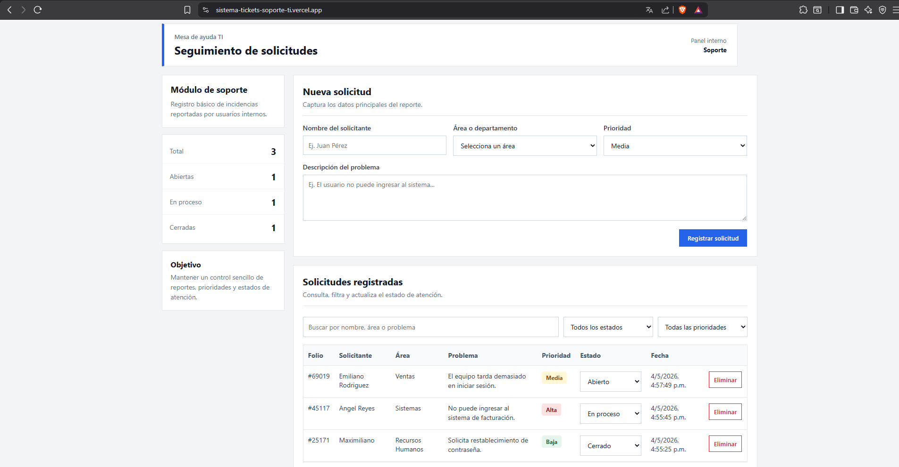

# Sistema de Tickets de Soporte TI

Aplicación web desarrollada con React para registrar, consultar y dar seguimiento a tickets de soporte técnico.

## Demo del proyecto

Puedes ver el proyecto publicado en el siguiente enlace:

https://sistema-tickets-soporte-ti.vercel.app/

## Captura del sistema

## Descripción del proyecto

Este proyecto fue desarrollado como una simulación de un sistema básico de mesa de ayuda o soporte TI.

La idea surgió a partir de la necesidad que tienen muchas áreas de tecnología de registrar y dar seguimiento a problemas reportados por usuarios, como fallas de acceso, errores en sistemas internos, problemas con equipos de cómputo o solicitudes de apoyo técnico.

El sistema permite capturar tickets de soporte, asignarles una prioridad, consultar los registros, filtrar la información y actualizar el estado de cada solicitud. Esto ayuda a tener un mejor control de las incidencias y evita que los reportes se pierdan o se administren de forma desordenada.

Este proyecto forma parte de mi portafolio como estudiante de Ingeniería en Sistemas Computacionales, con el objetivo de practicar desarrollo frontend, manejo de estados, formularios, filtros, persistencia local y publicación de proyectos en GitHub y Vercel.

## Funcionalidades

- Registro de tickets de soporte técnico.
- Captura del nombre del solicitante.
- Selección de área o departamento.
- Asignación de prioridad: baja, media o alta.
- Cambio de estado del ticket: abierto, en proceso o cerrado.
- Búsqueda por nombre, área o descripción del problema.
- Filtro por estado.
- Filtro por prioridad.
- Eliminación de tickets.
- Contadores de tickets totales, abiertos, en proceso y cerrados.
- Persistencia de datos usando LocalStorage.

## Tecnologías utilizadas

- React
- JavaScript
- HTML
- CSS
- Vite
- LocalStorage
- Git
- GitHub
- Vercel

## Aprendizajes aplicados

- Creación de una aplicación web con React.
- Manejo de estados con useState.
- Uso de useEffect para guardar información en LocalStorage.
- Uso de useMemo para optimizar el filtrado de información.
- Manejo de formularios.
- Renderizado condicional.
- Creación de filtros de búsqueda.
- Diseño responsivo con CSS.
- Control de versiones con Git y GitHub.
- Despliegue de una aplicación web en Vercel.

## Autor

Ángel Emiliano Reyes Rodríguez  
Estudiante de Ingeniería en Sistemas Computacionales  
Instituto Tecnológico de Iguala